<!DOCTYPE html>
<html>
<head>
  <title>PF Atlas Aviation Charts</title>
  
</head>
<body>

  <h1>PF Atlas Aviation Charts</h1>

  <section>
    <h2>Gatwick (EGKK)</h2>
    <a href="Gatwick (EGKK).pdf" class="pdf-link" target="_blank">View Gatwick (EGKK) PDF Chart</a>
  </section>

  <section>
    <h2>Punta Cana (MDPC)</h2>
    <a href="Punta Cana (MDPC).pdf" class="pdf-link" target="_blank">Punta Cana PDF Chart</a>
    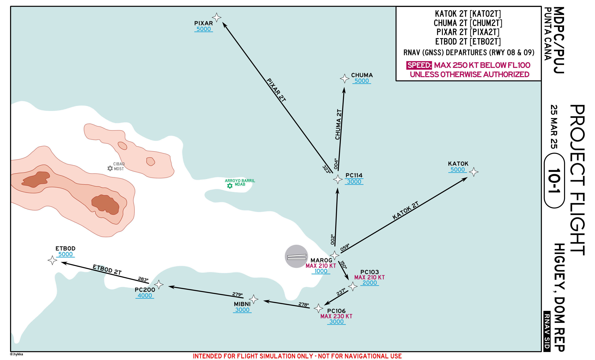
    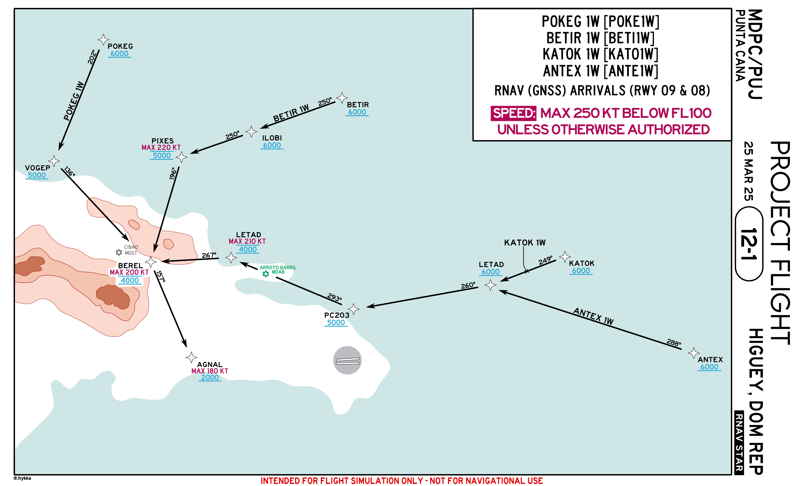
    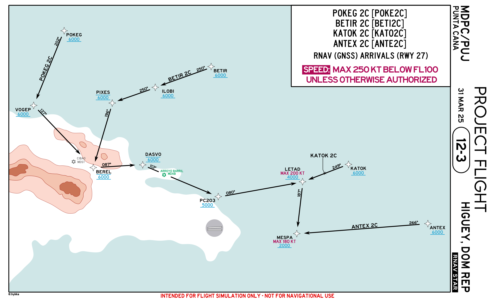
    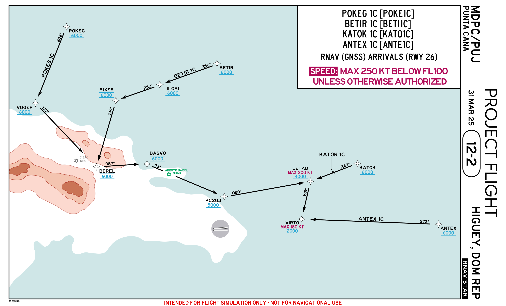
    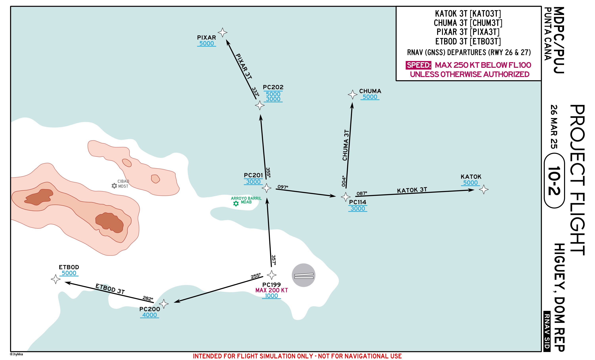
  </section>

  <section>
    <h2>Gran Canaria (GCLP)</h2>
    <a href="Gran Canaria (GCLP).pdf" class="pdf-link" target="_blank">Gran Canaria PDF Chart</a>
  </section>

  <section>
    <h2>LEMH</h2>
    
    
    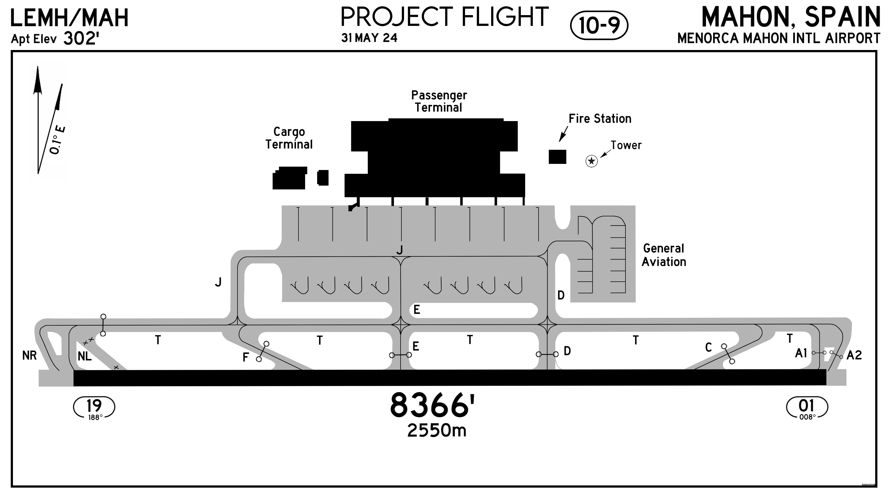
  </section>

  <section>
    <h2>EFKT</h2>
    
    
    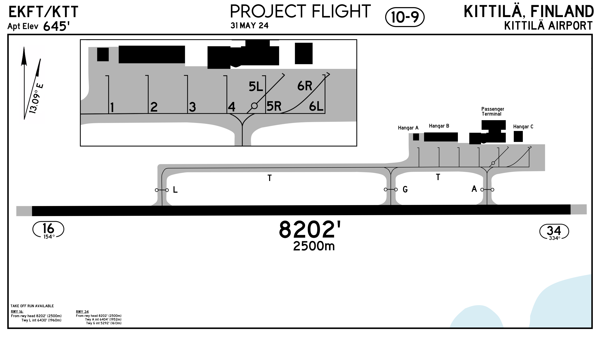
  </section>

  <section>
    <h2>EGHI</h2>
    
    
    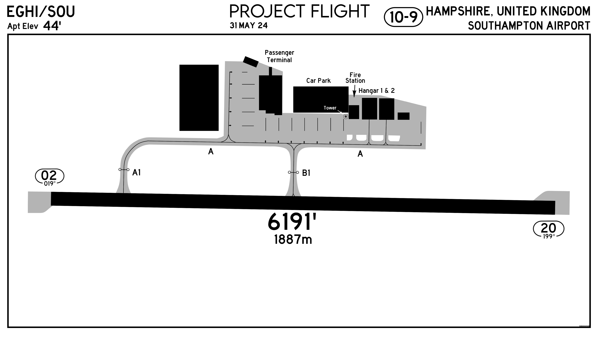
  </section>

  <section>
    <h2>LCLK</h2>
    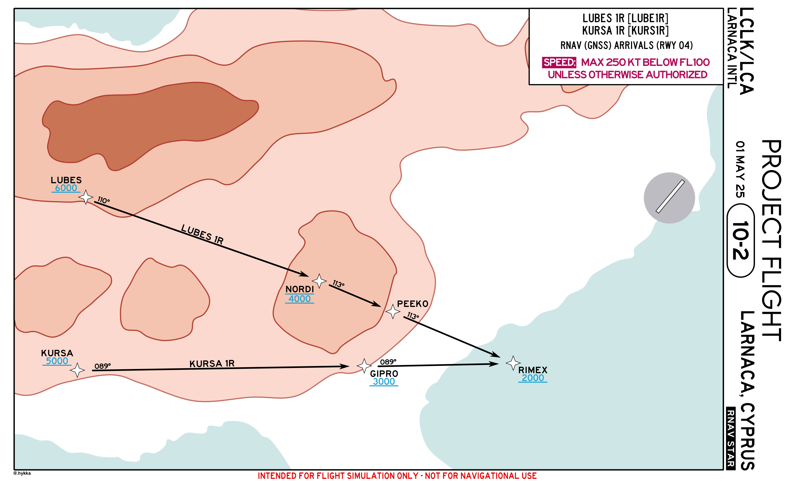
    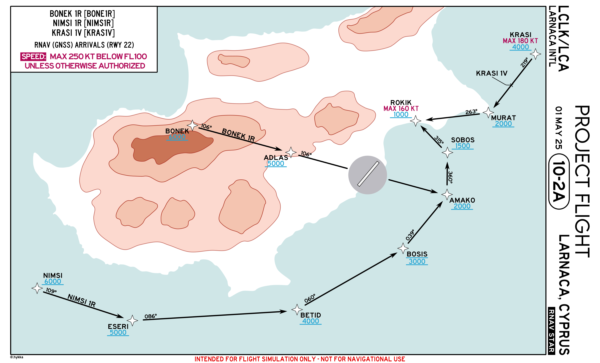
    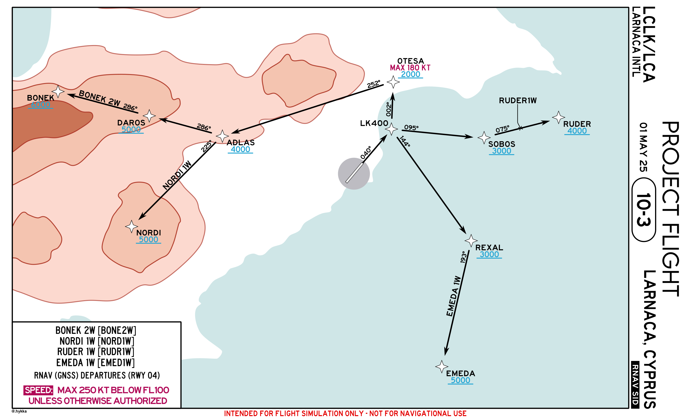
    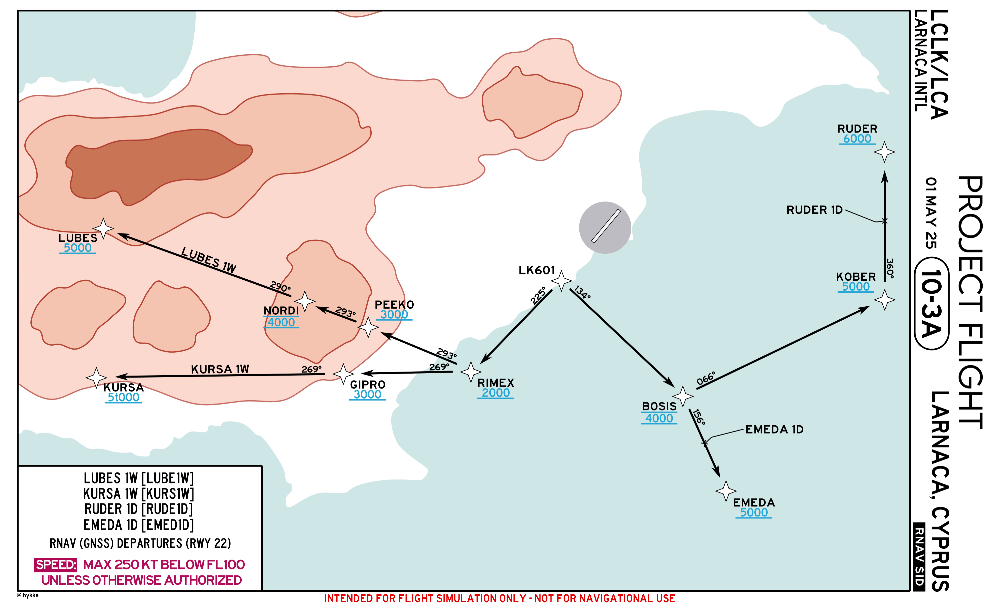
    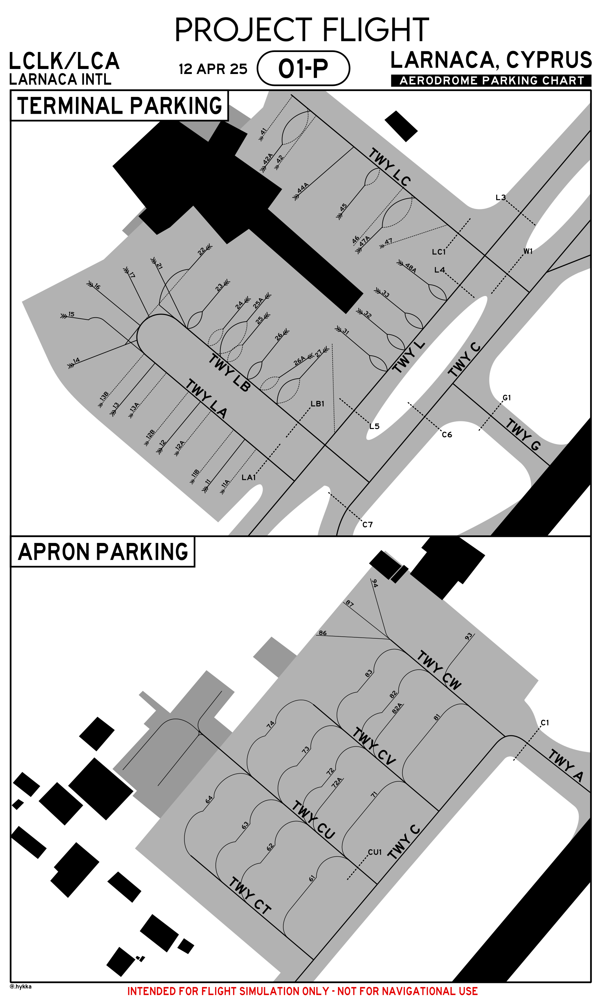
    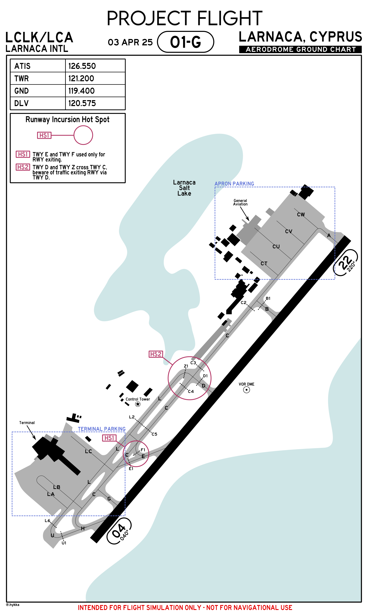
  </section>

  <section>
    <h2>Miscellaneous</h2>
    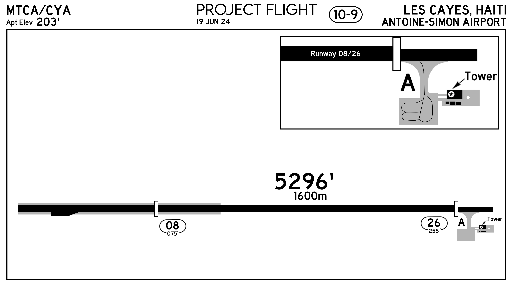
    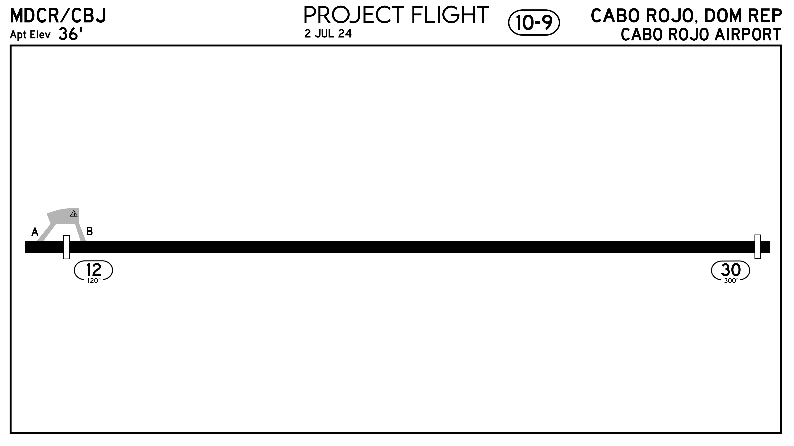
  </section>

</body>
</html>
